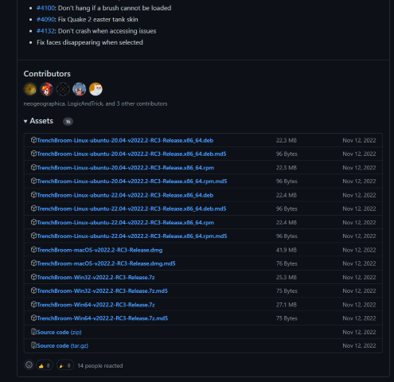
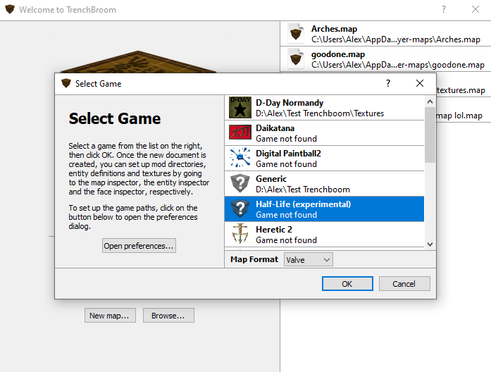
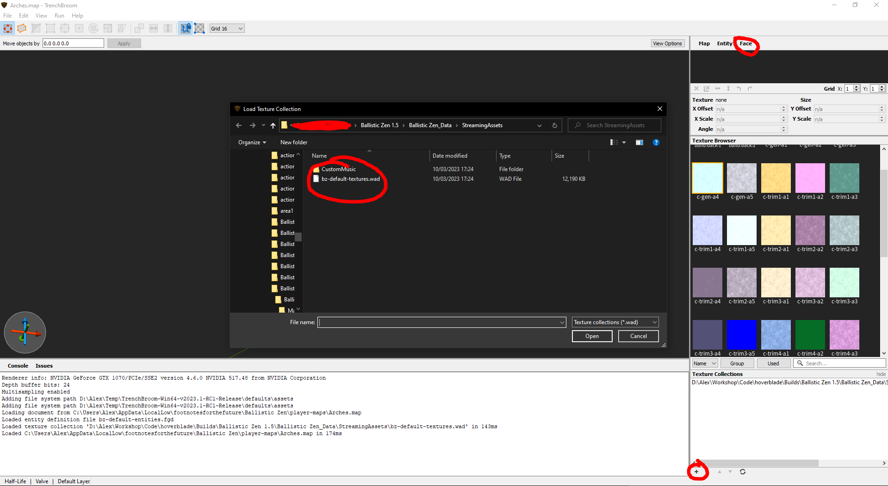
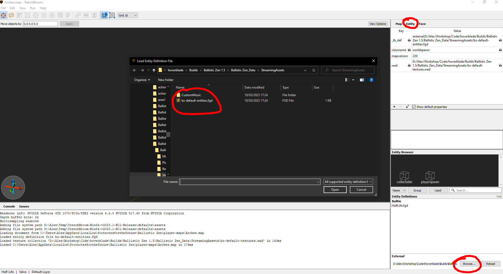

Ballistic Zen Custom Maps Tutorial
===

# Intro

Version 1.5 of [Ballistic Zen]((https://store.steampowered.com/app/1966930/Ballistic_Zen/)) brings custom maps. Version 1.4 of [Ballistic Zen](https://store.steampowered.com/app/1966930/Ballistic_Zen/) previously brought custom lines. This page will explain how to create and use both.

Custom maps are not fully implemented yet, and so are only available to paid users ([steam](https://store.steampowered.com/app/1966930/Ballistic_Zen/), or chose to pay on [itch](https://footnotesforthefuture.itch.io/ballistic-zen)). I would like to understand how much appetite for user generated content there is; if this release causes a spike in sales I will consider further development.

**If you desperately want to be part of the custom maps community but cannot afford the game, please don't hesitate to buy the game on Itch for the smallest possible amount of currency. This signals to me user generated content is very important to you!**

**Custom maps** are built in Trenchbroom and currently support:

* All textures that already exist in the game
* Collectables
* Spawning the player (obviously!)
* Custom lines

Custom maps do not currently support, in descending order of priority:

* Importing new textures
* Different visual styles for collectables
* Custom respawn triggers
* Custom spawn zones
* Other entities (boost pads)
* Pre-built lines (blue and white)
* NPCs
* Centralised hosting

**Custom Lines** are generated in game and the basic functionality is fully implemented. Further work required involves improved the management of lines (renaming, drafts, deleting, centralised hosting etc).

# Custom Maps

### Get Trenchbroom

[Trenchbroom](https://trenchbroom.github.io/) is a free and open source level editor. To use it:

* Follow [this link](https://github.com/TrenchBroom/TrenchBroom/releases)
* Scroll down to the release you want (I chose 2022.2)
* Scroll down a bit more to Assets
* Choose the appropriate download. For me it was `TrenchBroom-Win64-v2022.2-RC3-Release.7z`

* Download, extract, and run the .exe

### Set up Trenchbroom

To place the player spawn and collectables, and set different textures, you need to perform some additional setup.

* Open Trenchbroom
* Choose New Map
* Choose **Half-life (experimental)**. Yep, that's right!

* To set up textures:
  * Navigate to the Face tab
  * Press the plus button
  * Navigate to the `%BallisticZenInstallFolder%/Ballistic Zen_Data/StreamingAssets`
  * Select the default textures .wad file

* To set up entities:
  * Navigate to the Entity tab
  * Select Browse
  * Navigate to the `%BallisticZenInstallFolder%/Ballistic Zen_Data/StreamingAssets`
  * Select the default entities .fgd file

### Make your map!

Trenchbroom is a powerful program and how to use it is out of scope of this guide. You can find the fantastic manual [here](https://trenchbroom.github.io/manual/latest/).

* Don't forget to add a player spawn!
* Save the map to `%BallisticZenUserDataFolder%/player-maps`
  * You can find this on windows by going to `%AppData%`, going up a level, then going to `LocalLow\footnotesforthefuture\Ballistic Zen\player-maps`
  * Put maps from other players into this folder

Here is a map I made: [Big Ramps](Big Ramps.map). `Right click -> Save Link As` to the above location to give it a try. It's not very good! Feel free to use it as a starting point!

Currently the most official place to share your maps is the [discord server](https://discord.gg/XS29Pdr).

Custom lines will work on custom maps so don't forget to share both. See the next section!

# Custom Lines

Custom lines are created in game.

* Start recording a line with the `L` key
* Stop recording a line with the `L` key again
* Cancel the line with the `C` key, or, 
* Save the line with the `F` key

Watch [this video](https://www.youtube.com/watch?v=zbHPwwxpgT4) for a demonstration.

* Lines can be found in the following folder: `%BallisticZenUserDataFolder%/player-lines`
  * You can find this on windows by going to `%AppData%`, going up a level, then going to `LocalLow\footnotesforthefuture\Ballistic Zen\player-lines`
  * Put lines from other players into this folder

Here is a line I made for the main game: [Colossus](Colossus.bzl). `Right click -> Save Link As` to the above location to give it a try. You can find it in the pyramid. It's extremely difficult. Consider it a puzzle!

Currently the most official place to share your lines is the [discord server](https://discord.gg/XS29Pdr).

Custom lines will work on custom maps so don't forget to share both. See the above section!