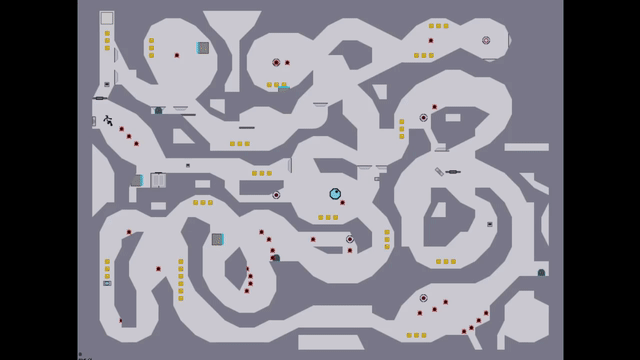
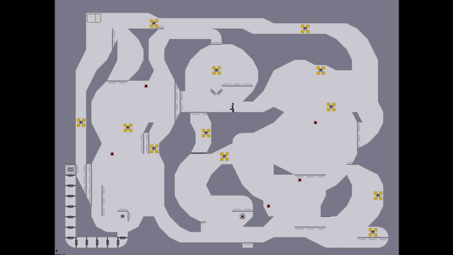
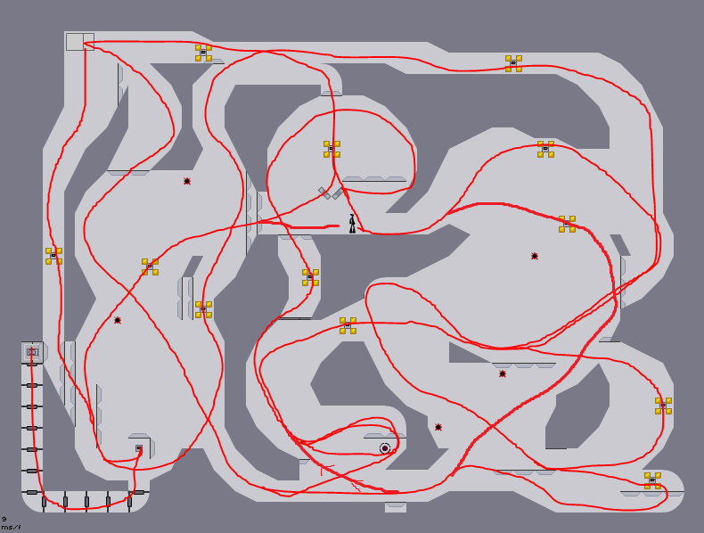
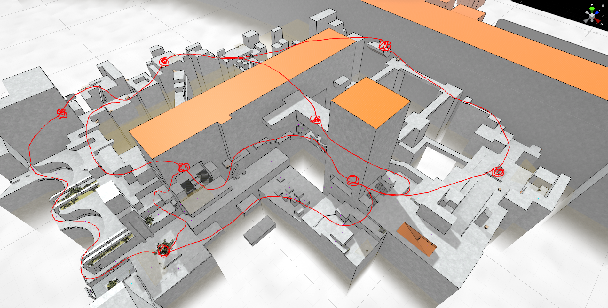
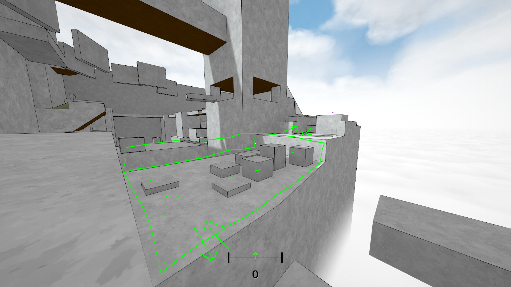
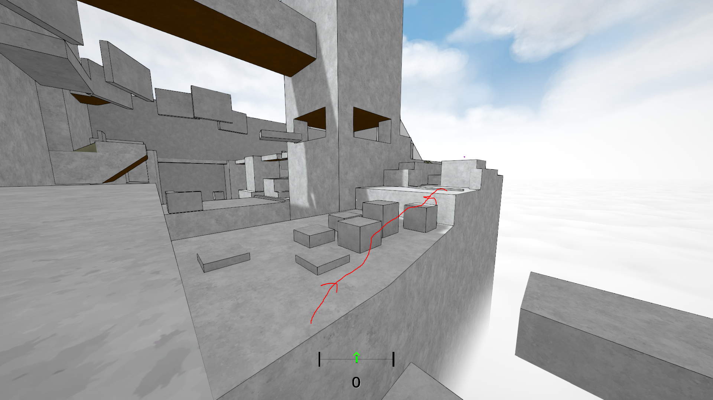
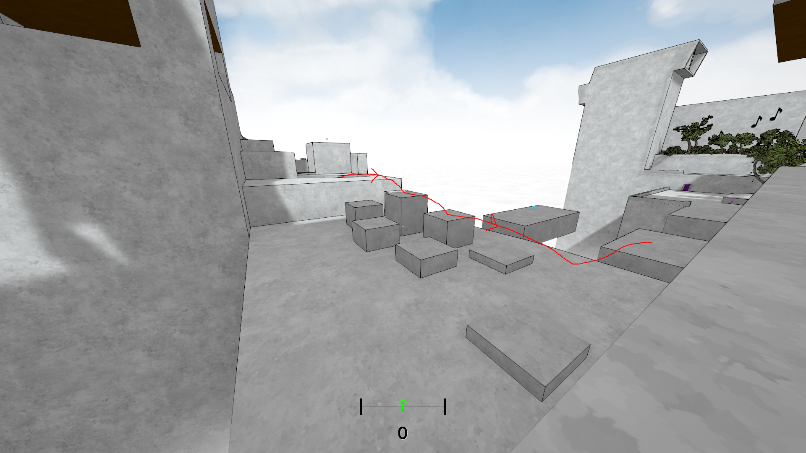
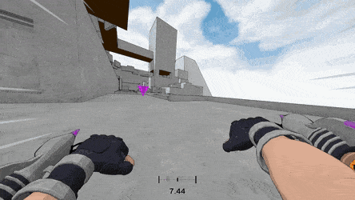
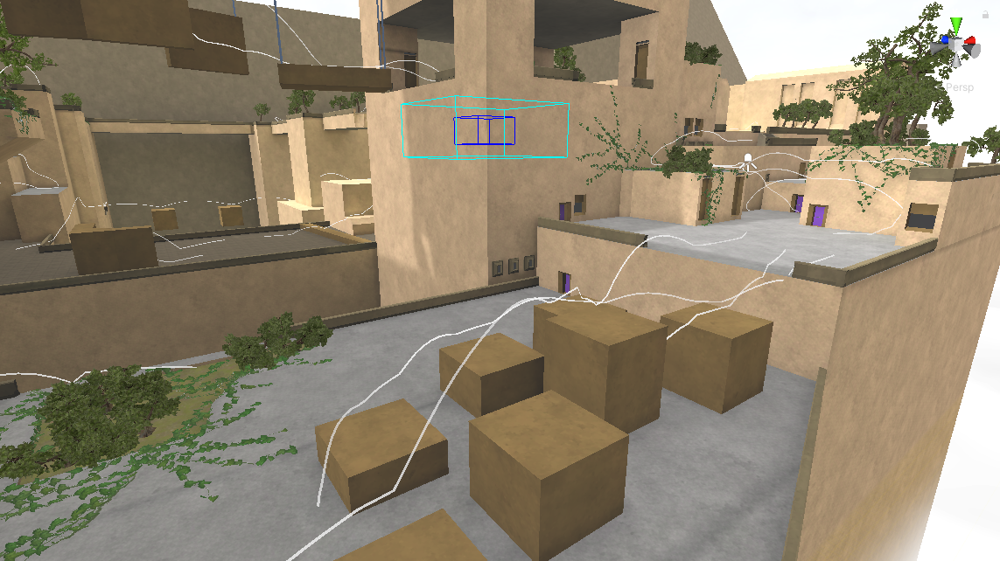

Designing Flow in Ballistic Zen
===

**Ballistic Zen is now available to purchase on [Steam](https://store.steampowered.com/app/1966930/Ballistic_Zen/), and you can discuss the game on my [discord](https://discord.gg/7nzsjUU).**

My main motivation for creating Ballistic Zen is to try and replicate a rare and distinct feeling that only a few other games give me. I'll call this feeling Flow.

Although I can play Ballistic Zen myself and feel Flow, it's clear from watching friends and play testers that in the alpha version there is not enough guidance, encouragement or reward for playing the game in the way I intend; others play Ballistic Zen in a different way from me.

The purpose of this article is to define Flow in Ballistic Zen, to describe the differences in the way that I play vs the way that others play, and to suggest some possible solutions. It's to help me organise my thoughts, and to introduce the problem to anyone who is interested in helping me design a solution.

## What is Flow?

Flow is already a term used to describe a mental state where a person is in "The Zone"[1]. My definition of Flow is an abstract description of game mechanics, but the two definitions are related in that a game that successfully implements the mechanics I describe will give rise to the psychological state of Flow. For the rest of this article, the term Flow will refer to the below definition.

Flow consists of 2 distinct but related concepts

1. Smooth and fast movement that has a feeling of momentum, that when mastered can become an unbroken chain of movements that "flow" into each other.
* A route finding decision process that the player constantly undergoes during movement, with forward planning that only extends so far into the future.

The first part, the *Movement Flow*, is a relatively obvious and common concept but the second part, the *Pathfinding Flow*, is more nebulous and rare.

### Movement Flow

There are already many games that feature "flowy" movement systems. Titanfall 2, Mirror's edge, Prince of Persia, Floating point, Sonic are just the very first examples that cross my mind. Typically games with "flowy" movement are platformer games. The goal for the game designer is for the movement to inherently *feel good*. In these games, a player should enjoy moving for the sake of moving.

Here is an example of a race from the game N v1.4. 

This is a linear map that needs to be practiced. Once the level is mastered the character moves with a pleasing smoothness as they are guided round the level by a combination of player input and the physical geometry.

Another example of smooth movement is "surfing". Here is an example from Counterstrike: Source.

This is also a linear level that requires mastery. Notice that the player is forced to take corners smoothly in order to maintain their speed. This is a key mechanic of Ballistic Zen also.

### Pathfinding Flow

The above examples of Movement Flow require that the player must practice the route over and over again to complete the level. There is a sense of rote learning. There is no planning on the player's part; only adjusting technique to deal with problematic areas in the level.

But a feeling of improvisation can be introduced by using non-linearity and loops. See another N v1.4 level:

To make the loops and non-linear routes more explicit, I have drawn them below:

The player can improvise their route with a degree of freedom.

The level is much easier to complete, which prevents the focus being on "how can I master this level technically" although practice is still required; especially general technical practice non-specific to the level.

The player is required to go down all paths at least once.

The loops are complicated enough that **the player is not encouraged to plan the entire route but is always able and encouraged to plan their next immediate destination**, and **as long as the player maintains a level of technical mastery they are able to maintain their Movement Flow**. Once again, there is an **improvisational feel**.

In this case there is a strong focus on paths that can be traversed in one direction. This leads to paths being repeated multiple times and increases the overall length of the level.  

There are also many paths that are adjacent to each other in literal forks. A player could exit one of these paths then do a U-turn to enter the adjacent path, but since this reduces flow it is not optimal in my eyes. I don't have enough testers to be sure but I suspect speedrunners would find the optimally short path, sacrificing their movement Flow to take these U-turns. Encouraging them not to do this is related to the problem I face in Ballistic Zen.

Another from the very short list of games with Pathfinding Flow is the *Freestyle* approach to surfing.

Freestyle surf maps were originally intended to be combat surf maps: 2 teams fight against each other using guns while surfing. Combat surf necessesitates relatively small arenas including teleports and boosts to make it easy enough to travel to anywhere another player might be, in a reasonably small amount of time.

Freestyle surf is simply surfing around these maps continuously for as long as possible, as stylishly as possible (where style is completeley arbitrary because it was never included in any game mechanics).

You can see above that with some technique a player can jump off the ramps at the bottom of the arena to continue their movement, potentially indefinitely.

In this case the ramps are all parallel. Connecting routes in a smooth way is down to the player. The ramps are fixed, but otherwise the paths are not predefined. Notice that the player spends a lot of time in the air adjusting how they will land on the ramp.

In N v1.4, the player decides *which path will take me to the next button*. In surfing, the player decides *which ramp can I land on next that won't take away my ability to continue surfing, and how can I adjust my path to get there* (note: landing on the bottom middle ramp in the map shown above kills your Pathfinding Flow because there are no paths that follow).

N v1.4 requires some more forward planning, and freestyle surfing has more open paths, but the two mindsets are very similar.

## Flow In Ballistic Zen

In Ballistic Zen turning the mouse smoothly speeds up the player character. Turning it unsmoothly slows the player character down. The player can run on and clamber up walls without losing speed. The movement component of Flow, while it could use tweaks, is already implemented well enough.

Ballistic Zen is set in one large freely explorable level. The main game is a series of events that are generally linear routes taken from some subsection of the main level.

In the downtime between events the player is free to explore. My goal is to offer a set of mechanics that **strongly encourage** or even **require** that the player experiences both Movement Flow and Pathfinding Flow i.e. the player utilises the existing movement while undergoing the constant route planning decision process I described above.

### Measuring Flow

My first attempt to solve this was to introduce a "combo" system where a meter is filled when the player turns smoothly or wallruns or makes a large gap (and so on), and is drained when the player is moving idly or unsmoothly. A friend introduced a related measure of "Smooth Flow" based on mouse smoothness only, forgoing the timeout element.

These passive rewards are not really a solution because a reward for movement flow already exists: acceleration. Progress bars like this only serve to emphasise the importance of Flow, but they don't explicitly make players think about routes in the way I want. I need to be more explicit.

In addition there is **already** a turning smoothness indicator, although as an instantaneous measure *it doesn't report continuous smoothness* in the way that using a timeout, or a counter that goes up or down does.

### What Does Route Planning Mean For Ballistic Zen?

The world of Ballistic Zen is structured into a series of *Hubs* that are connected by *Spokes*. Below is an image of roughly 1/5 of the world, with the main Hubs and Spokes outlined. Hubs are landmark areas that are small, open, and don't require any technical mastery to traverse. Spokes are linear routes with multiple traversal options over the same route. Spokes can connect with each other. Each Spoke may have multiple *Paths* to traverse it. Paths are not shown on the diagram

The unmarked areas are generally shortcuts, "longcuts", or areas with dead ends that are intended for exploration.

To demonstrate further, here is an area in Ballistic Zen that we can consider a spoke:

It has an entrace and exit, and can be traversed forwards and back.

An example of traversing up:

A second example of traversing up:

An example of traversing down:

The examples above illustrate the mental model I want players to have while playing Ballistic Zen.

I want to introduce a mechanic that will train players to **see, think and plan in terms of paths**. Further, I don't want to predefine paths. Players should learn how to see them themselves. If a spoke is traversed multiple times, the mechanic should encourage the player to take different paths each time.

Because this activity is intended for between mission downtime in a free roaming environment, it must be *repeatable* and should *start and finish anywhere* at the player's discretion.

And some notes on level design:

* Due to the movement mechanics the only reliable way to make a one directional Spoke or Path is to make a large drop
* If a wall is present it is very easy to do a U-turn and maintain movement Flow so it is very difficult to design a Spoke fork where the available options depend on the direction of travel (like what was done in in N v1.4)
* It's difficult to see across the level, which has implications on how goals can be telegraphed

The above may change, especially in late game areas, but for now the mechanic should take these characteristics into account.

### Collectables - A Potential Solution

My current working solution is a collectables combo system. The player finds an initial collectable which reveals collectables along the paths I have already thought of (but not defining them). The combo remains as long as the player keeps picking up collectables before their time runs out. Each collectable resets the timer. The intention is that players will be able to identify paths themselves, chaining them together to form long routes.

Here I take one of the paths I outlined above up the Spoke, then another of the paths back down, leaving me with remaining time to continue my combo elsewhere.

The theory is that players will eventually learn that to keep their combo going for as long as possible they must tactically leave collectables to come back and pick them up later, but there is not nearly enough incentive to do that: players beeline straight for the collectables, killing their Movement and Pathfinding Flow (next time they come round, there are no collectables to suggest to them a path to travel down).

### [Update 22/05/2021] Paths - A Solution!

For this article I have drawn diagrams with the paths I hope players would take on subsequent travel through different areas. It would be so easy if I could just draw the paths in game! There is precedent for this; other games feature races that are displayed as a linear path that 'lights up' as the player progresses down the path. But initially I rejected this idea for the following reasons:

* Showing all possible paths is visually noisy
* Showing all possible paths is difficult (impossible?)
* Littering the map with paths implies that non-marked areas are not traversable
* Players may try to complete all paths as they see them, causing the player to take non-flowy routes between paths

But there's a simple soution! Display only a random subset of paths; as paths are completed display a currently inactive path (including paths already completed):

* No visual noise
* Players are trained that areas they may have considered non-traversable are actually traversable, based on the appearance of unexpected paths
* Because paths come back, paths become 'optional', and the player is free to follow or ignore them

Here all the paths are displayed together (also with a new art style!):

## Conclusion

So there it is. A solution I'm happy with. From very limited external playtesting it seems to be fun. It remains to be seen whether a wider audience will interact with paths in the way I expect. 

If you have any game recommendations that feature Pathfinding Flow, for goodness sake please get in touch with me. I need more!

[1]: https://en.wikipedia.org/wiki/Flow_(psychology)