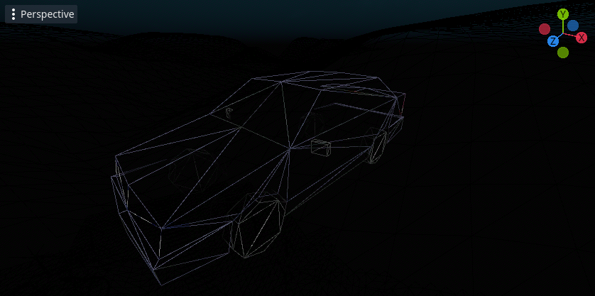
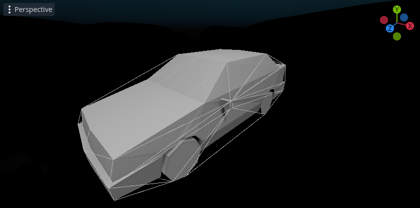
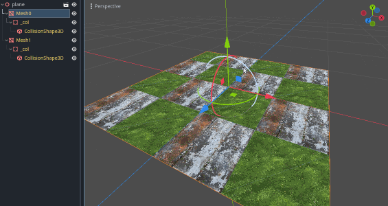
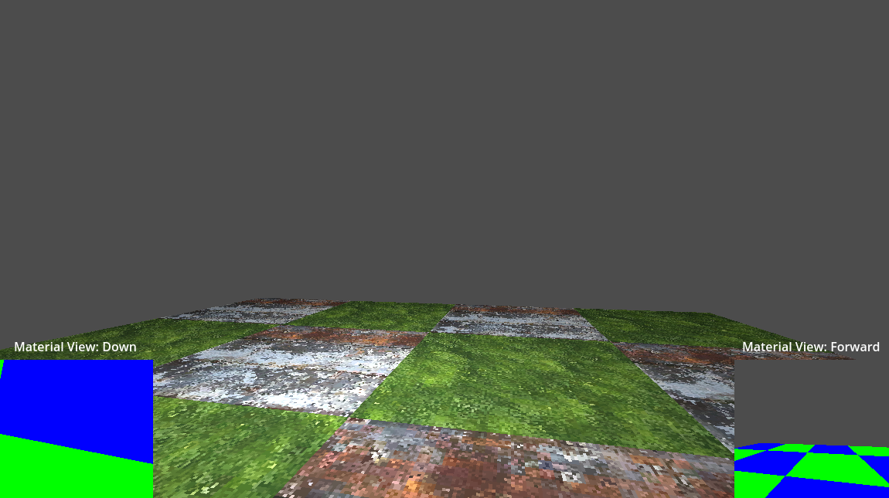

Material Based Footstep Sounds in Godot
===



I'm currently using Godot to develop a first person horror game. Sound is extremely important in creating a vibe. The video above demonstrates how footstep sounds change based on the material the player is standing on.

Playing sounds based on materials is not trivial to implement, and there are a few different options with various pros and cons. This article describes what's hard about this problem (in Godot), and describes how it can be solved.

This article focuses on the hard part - identifying the material. This article only lightly addresses playing sounds. Material identication can be used for other tasks also (bullet impact sounds, varying animations etc).

You can find example code for each implementation discussed in this article [here](https://github.com/alexjhetherington/godot-identifying-materials-examples).

**Wishlist 3 Shots Left on [Steam](https://store.steampowered.com/app/2902400/3_Shots_Left/), and discuss the game or this article on my [discord](https://discord.gg/hHFZbDzR57).**

# Basic Footsteps

A prerequisite to playing footstep sounds based on the material the player character walks over is to play footstep sounds in general. A full tutorial for that is outside the scope of this guide, but here are a few pointers:

* For third person games: use the Godot animation system to play a sound whenever the character animation makes a step
* For first person games: play a sound every x seconds while the player is moving
  * Don't play sounds while the player is in the air or in a non-walking move state
  * Sound interval should change with different player speeds / move states
* Consider creating a system that plays a random sound from a selection to stop footsteps feeling repetitive
* Consider randomly adjusting the pitch of each clip that is played to further reduce repetition (pitch change does not need to be extreme for this to be effective)

# The Algorithm
Once footstep sounds are implemented, the high level algorithm to play sounds based on material is straightforward:

1. Wait for next footstep sound trigger
2. Determine which material the player character is currently stepping on
3. Map that material to a sound or selection of sounds
4. Play the mapped sound (or a randomly selected sound from the set of mapped sounds)

Step 2 is a technical challenge and is the focus of this guide.

Step 3 is relatively straightforward but will also be addressed at the end of the guide.

# Material Identification - Raycast Based Techniques

## Motivation and Challenges

Due to the complexity of meshes these days, games usually use different objects for visuals and physics. 

The material is stored on what I will call the *Visual Mesh.* In Godot you will often see this referred to as *Mesh*<sup>[1]</sup>, or *ArrayMesh*<sup>[2]</sup>. *MeshInstance*<sup>[3]</sup> refers to a specific instantiation of a given mesh (you can re-use the same *Mesh* multiple times in the same scene).

Our character physically interacts with what I will call the *Collision Shape.* In Godot you most often see a *Shape3D*<sup>[4]</sup> (the shape itself) referenced by a *CollisionShape3D*<sup>[5]</sup> as a child of a *StaticBody*<sup>[6]</sup>.

*Collision Shapes* are often much simpler than the *Visual Mesh.*

Visual Mesh:

Collision Shape:


Notice how the collision shape is like a "wrapper" around the actual model geometry.

**All that is to say:** this separation of visual mesh and collision shape influences API design in a way that makes it difficult for us to identify the material at a given point. See Appendix 2.

In Godot:

* You *are* able to physically query the environment (for example using raycasts) to identify collision shapes
* You *are not* able to physically query the environment to identify visual meshes

In most cases (hopefully including yours) we can work around this using the following assumption:

* Usually the collision shape is in a predictable location in the node hierarchy compared to the visual mesh

We can thus propose the following algorithm:

1. Raycast down to identify the collision shape currently underneath the player
2. Traverse the hierarchy to identify the visual mesh associated with the collision shape currently underneath the player
3. Identify the material in that visual mesh that is directly underneath the player

Unfortunately step 3 is also a challenge: the Godot Mesh API does not offer a pleasant way to query materials spatially. This leads to our first major conclusions:

* We cannot spatially differentiate materials on a visual mesh trivially
* If a visual mesh has only a single material and a player is standing on the collider associated with that visual mesh, we can be sure the player is standing on that material
* If a visual mesh has multiple materials, we must split that visual mesh up based on material and determine which "sub-mesh" the player is standing on

There are a few ways we can do this (and the choice is yours).

## Query All Triangles At Run Time

Godot offers a few APIs that return mesh information on a per material basis. Note: the Godot API refers to *surfaces* rather than *materials* when accessing data in this way because each group of information (vertices, faces, etc) does not change when the *material* is overriden.

Using one of these APIs we can perform the following algorithm:

1. Raycast down to identify the collision shape currently underneath the player
2. Traverse the hierarchy to identify the visual mesh associated with the collision shape currently underneath the player
3. Split the mesh into a "sub-mesh" for each material
4. For every triangle in each "sub-mesh", perform a triangle raycast to determine if that triangle is under the player
5. The triangle under the player is part of the "sub-mesh" that has the result material

The Mesh API<sup>[10]</sup> offers methods to return all the necessary information:

```
for surface_idx in mesh_instance.mesh.get_surface_count():

    var surface_arrays = mesh_instance.mesh.surface_get_arrays(surface_idx)
    var face_vertex_indices := surface_arrays[Mesh.ARRAY_INDEX] as PackedInt32Array

    for face_index in face_vertex_indices.size() / 3:
      var vertex_1 = surface_arrays[Mesh.ARRAY_VERTEX][face_index * 3]
      var vertex_2 = surface_arrays[Mesh.ARRAY_VERTEX][face_index * 3 + 1]
      var vertex_3 = surface_arrays[Mesh.ARRAY_VERTEX][face_index * 3 + 2]
      
      # Build and test triangle
```

Alternatively, Godot offers an API called MeshDataTool<sup>[7]</sup> that is intended for creating and editing meshes at run time.

Here is a full [example](https://github.com/alexjhetherington/godot-identifying-materials-examples/tree/master/raycast_mesh_data_tool) version using MeshDataTools.

My version builds the MeshDataTool for each Visual Mesh the first time it is stepped on. This could be done on scene load.

The main pitfall with writing this algorithm is making sure that you correctly translate locations from the world (where the visual mesh instance is) to and from the local space of the "sub-mesh" in cases where the "sub-mesh" does not have a world concept (e.g. when using MeshDataTools).

**Pros of this approach**:

* It is just code: there are no special steps required during the asset import pipeline, and you don't need to worry about the node hierarchy

**Cons of this approach**:

* One-time construction of MeshDataTools can be time consuming
* While surprisingly performant on small meshes, the time it takes to find the appropriate triangle directly scales with the size of the mesh

If you have large meshes in your game, this approach can introduce significant frame hitches. This is especially a negative for requests that happen quickly, like bullet impact sounds.

I would recommend this solution only if you are searching for a pipeline agnostic workflow. 

### Optimising Triangle Queries

If you're particularly clever or wedded to the idea of a pipeline agnostic solution, you might propose some optimizations to the triangle query approach.

The idea for optimisation is as follows:

* In the best case scenario, the player is stood on the first triangle that is checked; so the material is essentially instantly found
* In the worst case scenario, the player is stood on the last triangle that is checked; so every single triangle on the mesh is checked before the material is found
* Perhaps we can intelligently influence the algorithm to reduce the amount of triangles that are checked on average

You can completely ignore triangles that are known to be irrelevant:

* Triangles where the normal faces sideways or down are walls or ceilings and not relevant for footsteps (the MeshDataTools api makes this trivial!)

You can skip raycasting triangles at run time based on the input position:

* Triangles where each vertex is higher than the player can be ignored because the player cannot be standing on them

You can influence the order triangles are checked using heuristics:

* Triangles with a centre close to the player are more likely to be triangles the player is standing on

I experimented with OctTrees<sup>[8]</sup> and the simpler data structure of splitting the world into chunks (non recursively) with some success, but I was never able to entirely prevent slow queries. I don't recommend you try to optimise the MeshDataTool approach.

That being said, I would be interested in hearing about your experiments in this area!

## Mesh Processing

Performing a raycast against each triangle of a visual mesh is expensive. As an alternative we can generate *collision shapes for each material,* and *associate each collision shape with that material.*

With this technique, the algorithm looks like this (see Appendix 1 for discussion on how this might vary):

1. Pre-process:
  1. Use EditorScenePostImport<sup>[9]</sup> to override the way Godot imports models:
  2. Create a visual mesh *for each material*
  3. Create a StaticBody with appropriate CollisionShape *for each material*
  4. Remove the default generated Visual Mesh and StaticBody
2. Runtime:
  1. Raycast down to identify the collision shape currently underneath the player
  2. Traverse the hierarchy to identify the visual mesh associated with the collision shape currently underneath the player
  3. That visual mesh only has one material; that's the material we're searching for

A single checkerboard mesh imported from Blender has been split into two separate meshes:


Here is an [example](https://github.com/alexjhetherington/godot-identifying-materials-examples/tree/master/raycast_mesh_pre_process)

Once the mesh has been split, finding the material is a trivial process.

**Pros of this approach**:

* Negligable performance impact (there is an increased number of colliders in the scene)

**Cons of this approach**:

* Potentially reduces collision reliability (read convex vs concave collisions<sup>[10]</sup>)
* Relies on the mesh import pipeline; if you use level design tool addons inside Godot it is likely you would need to modify those to achieve a similar affect

This approach receives my most general recommendation due its performance and relative ease of implementation. See Appendix 1 for further discussion.

# Material Identification - Camera Based Techniques

## Motivation and Challenges

There are some scenarios where a raycast / mesh based approach is inappropriate. For example:

* **One material has multiple associated sounds (perhaps height smoothly transitions between two textures)**
* Preprocessing is undesired or impossible

In such cases, we can consider a camera based approach. The basic idea is to add a new camera to the scene that follows the player. This "material camera" sees a simplified view of the world; it sees only block colours instead of textures. It sees, for example: grass as solid green; concrete as solid grey; metal as solid blue etc. The algorithm for selecting sounds then looks like this:

1. Render the downward facing "material camera" to a texture
2. Read a pixel from that texture
3. That pixel's colour corresponds to a material / sound



The camera based approach is simple and performant, but only appropriate when there is a predictable view that can be used for material identification. This approach would be unsuitable for bullet impact sounds, for example.

If your game is moddable, this approach may be unsuitable: it can be difficult to incorporate setting up the material / colour mapping into the modding workflow.

## Duplicate Meshes

The simplest implementation of the camera based approach is to duplicate the world environment, override materials on the duplicate, and use visual culling groups<sup>[11]</sup> to ensure the main camera doesn't see the duplicate world environment and the material camera doesn't see the original world environment.

Here is an [example](https://github.com/alexjhetherington/godot-identifying-materials-examples/tree/master/camera_duplicate_mesh).

**Pros of this approach**:

* Conceptually very simple

**Cons of this approach**:

* *Duplicate visual meshes in the scene* 
* Potentially lots of manual work - see this [video](https://www.youtube.com/watch?v=8GbanksN7ro) for inspiration on how vertex colouring may reduce manual work

The manual work required for this approach leads me to recommend against it - but it may be appropriate depending on your workflow.

## Custom Material

Godot shaders have access to the viewing camera's culling groups<sup>[12]</sup>. We can abuse this to create a *custom material* that *is viewed differently by different cameras*. In this way, we can achieve the same effect as the previous method without duplicating meshes.

An example with groups:

* Visual mesh is in visual group 1
* Main camera *and* material camera see visual group 1
* No mesh is in visual group 2
* Main camera sees visual group 2; material camera does not see visual group 2
* Shader on visual mesh (in visual group 1!) displays *differently* to main camera and material camera

This approach requires some care when dealing with lighting; if the material is lit, the flat colour display version is also lit. This lighting can interfere with the mapping of colour to material / sound. This can be worked around by also disabling lighting based on camera visual group; this is a challenge because the automatically generated shader template from Godot does not include lighting, so you will need to re-write the normal lighting function yourself.

Here is an [example](https://github.com/alexjhetherington/godot-identifying-materials-examples/tree/master/camera_custom_material). Pay specific attention to `dual_material.gdshader`.

**Pros of this approach**:

* No extra visual meshes
* After initial material setup, no manual work required

**Cons of this approach**:

* Requires a custom shader!

If you need to use a camera based approach, I recommend this option. After the initial (perhaps costly) time investment, this approach is simple and easy to maintain.

# Mapping Materials to Sounds

Mapping materials to sounds is relatively straightforward compared to identifying the material. A tutorial falls out of scope of this guide, but here are some pointers:

* The output of a raycast based approach is likely to be a string - the material name. Substrings can be used to map multiple materials to the same sound
* The output of a camera based approach is likely to be a pixel colour. This can be directly mapped to sounds - perhaps close colours can map to the same sound
* I recommend creating a resource that stores the mapping of material name / colour to sound

# Summary

The repo with all examples can be found [here](https://github.com/alexjhetherington/godot-identifying-materials-examples/tree/master).

From most to least, I would recommend you choose your method of identifying materials in this order:

1. Raycast Based / Mesh Preprocessing - this is the most performant in most scenarios, and is relatively straightforward
2. Camera Based / Custom Material - initial setup is costly but is thereafter straightforward
3. Raycast Based / Triangle Raycasts - this method is not performant, but at least requires little manual setup
4. Camera Based / Duplicate World - the level of manual work required to set this up is extremely costly (but it might be different based on your workflow!)

My game, **3 Shots Left**, currently uses Camera Based / Custom Materials because I import levels using a Godot addon that skips the import process, and the addon is not easily modifiable. I might switch to Raycast Based / Mesh Preprocessing in the future!

And the result:


# Appendix 1 - gongpha / gd4-simple-mat-footsteps

During my research I found the repo `gd4-simple-mat-footsteps` by gongpha [here](https://github.com/gongpha/gd4-simple-mat-footsteps)

This repo offers some inspiration for variations on the preprocessed mesh splitting approach:

* Mesh preprocessing happens at runtime, not import time
* Mesh preprocessing is determined with a script that recursively iterates it's children to detect and process meshes
* The preprocessor does *not* split the visual mesh
* The preprocessor does *not* remove the initial collision shape
* The preprocessor creates collision shapes for each material *on a different layer*; checking for material is intended to be done on a different layer than move physics (for example)
* Without multiple visual meshes there needs to be an alternate way of assocating eacah collision shape with material; node *meta* data is used for this purpose

# Appendix 2 - mesh raycasts

This problem would be much simpler if we had an API that:

1. Allowed us to check raycast intersections with visual meshes
2. Returned the material, or information that allows us to deduce the material, like a face index

Of course people have asked for this. See related proposals [here](https://github.com/godotengine/godot-proposals/issues/3909) and [here](https://github.com/godotengine/godot-proposals/issues/2863).


[1]: https://docs.godotengine.org/en/stable/classes/class_mesh.html
[2]: https://docs.godotengine.org/en/stable/classes/class_arraymesh.html
[3]: https://docs.godotengine.org/en/stable/classes/class_meshinstance3d.html
[4]: https://docs.godotengine.org/en/stable/classes/class_shape3d.html
[5]: https://docs.godotengine.org/en/stable/classes/class_collisionshape3d.html
[6]: https://docs.godotengine.org/en/stable/classes/class_staticbody3d.html
[7]: https://docs.godotengine.org/en/stable/tutorials/3d/procedural_geometry/meshdatatool.html
[8]: https://en.wikipedia.org/wiki/Octree
[9]: https://docs.godotengine.org/en/stable/tutorials/assets_pipeline/importing_3d_scenes/import_configuration.html#using-import-scripts-for-automation
[10]: https://docs.godotengine.org/en/stable/classes/class_concavepolygonshape3d.html#class-concavepolygonshape3d
[11]: https://docs.godotengine.org/en/stable/classes/class_camera3d.html#class-camera3d-property-cull-mask
[12]: https://github.com/godotengine/godot-docs/issues/8482