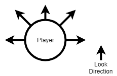
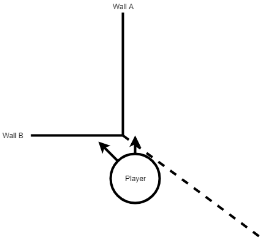

Wall Running in Unity: Making It Work, Making It Feel Good
===

**Ballistic Zen is now available to purchase on [Steam](https://store.steampowered.com/app/1966930/Ballistic_Zen/), and you can discuss the game on my [discord](https://discord.gg/7nzsjUU).**

I'm currently using Unity to develop a first person platformer in which the player can run on walls.

Here is my progress so far:


### Basic wall running

We don't need much to create the wall running effect:

* A 3d environment filled with colliders which act as walls
* A player whose movement we will abstractly define as a 3d vector every frame. I use the built in Character Controller<sup>[1]</sup> as a base
* Raycasts<sup>[2]</sup>:  lasers we can fire at the environment that will report information about things they hit<sup>[3]</sup>

At a high level the algorith for wall running is, each frame:

1. Detect wall(s)
* Select wall for wall running
* Calculate wall running direction
* Move

#### Detect Walls

To detect a wall we fire a raycast from our character into the scene. Choosing where to fire our raycasts is intertwined with how we want to select our walls, so I will discuss that in the next section.

Once we have fired our raycast into the scene, we will have a RaycastHit object that represents any collisions it made in the scene. Examining this we can evaluate whether it hit a runnable wall:

1. RaycastHit.collider == null? If yes - it hit something! Maybe a wall...
* RaycastHit.normal dot Vector3.Up == 0? If yes - the two vectors are orthagonal which means the wall candidate is perpendicular to the ground. That's a runnable wall!

#### Select Walls

Now we know how to find walls in the scene, we need to decide where to look. My approach has evolved over time.

To begin wall running, we can fire raycasts all around the player.



We can then choose the nearest wall from the viable candidates by comparing RaycastHit.distance.

While wall running, we do not need to send raycasts all around the player. In this case we know we can expect a wall to the player's side so we can fire a single raycast directly at the wall.

The direction of the raycast is RaycastHit.normal * -1 i.e. the opposite of the vector that is pointing directly away from the wall.

#### Calculate wall running direction

RaycastHit.normal X Vector3.Up (cross product) gives us an orthagonal vector to "Directly Up" and "Perpendicular from the wall"- this is a vector along the wall. This is our move direction!

We may need to multiple the resulting Vector by -1 if the player is facing the opposite way. You can check this by looking at the sign (positive or minus) of wallRunDirection dot (player forwards direction).

You might choose player forwards to be the current look Vector, or the current move Vector.

#### Move

We have a wall and we have a direction. Now it is up to you to write code to move your player character in this direction. I will leave this as an excercise to you.

A tip: RaycastHit.normal and RaycastHit.point can be used to create a unity plane<sup>[4]</sup>. Plane.GetDistanceToPoint will tell us the current distance from wall. You can use this to add a velocity or set the player's position so they arrive at the correct distance from the wall.

### Making it feel good

To make wall running feel good we need to give the player feedback as they do it. Some ways we can do this are :

1. Adjust the physics of the wall run
* Add sound effects
* Add UI changes
* Add physical effects (e.g. the player's arm touching the wall)
* Camera effects

Most of these are out of the scope of the article, but I will talk about camera FX.

#### Camera Tilt

The most common camera FX, seen in Mirror's Edge and Titanfall for example, is a camera tilt during the wall run. Creating this effect is very simple. I use a tweening library called Leantween <sup>[5]</sup>. There are many other tweening libraries.

The leantween version of this looks like:

```csharp
var rotateOut = LeanTween.rotateLocal(movementController.cameraRoll, new Vector3(0, 0, 12.5f * direction), timeToSnap).setEase(LeanTweenType.easeInOutCubic);
```

The syntax will vary by library but the point is that cameraRoll will be adjusted by 12.5 degrees over "timeToSnap" seconds.

This camera tilt makes it clear to the player when wall running is happening.

To make it clear that a wall run is about to end, we can slowly reduce the camera tilt such that the camera returns to 0 degrees of tilt at the same time as the player is ejected from the wall (appropriate when there is a time limit on wall running). You can see this effect in Titanfall 2.

#### Camera Rotate

Titanfall 2 does another very useful thing. The player never wants to look into the wall; it stops them from seeing where they are going. We can add a smooth rotation away from the wall so that the player doesn't need to adjust the view themselves and can concentrate on planning their route through the level.

Because we want to allow the player to adjust their rotational view even as the game adjusts it automatically Leantween is not an appropriate solution. I check the angle between the current camera horizontal look direction and the desired minimum horizontal look direction (5 degrees away from the wall) - and perform a small rotation towards the minimum look direction every frame as necessary. The further into the wall the player is looking, the quicker this rotation happens.

Here is a comparison of wall running with and without camera FX. The camera look rotation effect especially can be quite subtle.


### Extras

#### Jumping off walls

Wall jumping is relatively straight forward. The small gotcha is stopping the player from instantly reconnecting to the wall they just jumped from.

One way to do this is to add a cooldown to wall running. This also helps from a game design perspective because it stops players being able to infinitely climb a single wall.

I keep a record of the last RaycastHit.normal that caused the player to enter or kept the player in a wall running state. If the player is currently not in the wall running state and a new wall detected has the same RaycastHit.normal as the previous wall, it is not considered a viable wall. After some time, I reset the stored normal to null.

As soon as a player hits a new wall, the last RaycastHit.normal is overriden, effectively removing the cooldown on that wall. This means a player can bounce between two walls as fast as they can travel between them. I'm happy with this behaviour.

#### Catching on corners

After much playtesting I discovered an edge case that was incredibly frustrating. If a player went near a wall intending to pass it, wall running would still sometimes be triggered interrupting the players movement.

To fix this I added an additional check. After viable walls have been found, I do a final forward raycast with long range to check that the player is looking at one of the viable walls. Only if the player has their view centered on a wall can they run on it.

This is illustrated best by the below gif (it may be difficult to see but there is a crosshair that indicates exactly where the player is looking).


This forward check needs to be disabled if the player is already wall running because we want to allow the player to look away from walls while doing so.

#### Connecting near corners

A whole host of obscure edge cases were solved with one change. Here is the example I struggled to understand for days.



Player is moving roughly towards a corner. He intends to wall run on Wall A. He is closer to Wall B.

Wall B is discarded as a viable candidate because the player is not looking at it.

Player reaches Wall A and begins wall running.

The requirement to be facing the wall is dropped. ***Even though player has begun wall running on Wall A, player is still closer to Wall B*** (position seen in the diagram) and immediately starts wall running down Wall B.

The solution is to record the point at which the player connected with the wall. ***Note*** This point is at which the raycast hit the wall first, not where the player was located at the time. When checking for wall candidates, we can then discard any raycast hits that land 'behind' this point.

When the player is located behind this first hit point (happens at the start of the wall run), I probe a special calculated raycast directly to the hitpoint, to ensure the current wall is correctly checked.

#### Going around corners

This approach to wall running should work around corners without much modification.

Going around the outside of corners will require a raycast distance further than the distance the player connects to the wall.

I also noticed jittery behaviour on corners as the player character cannot decide which wall to stick with.

To solve this I added an additional small cooldown for connecting to the previous wall normal when switching to a new wall.

### Conclusion

The best way to figure this stuff out is to obsessively play and study other games. Titanfall 2 is a huge inspiration, especially for camera effects. Nevertheless, it's also important to have a strong vision about what you're doing differently.. There are a few techniques Titanfall 2 uses that increase the flow substantially, but that wouldn't be appropriate for my game. One thing they do is increase player speed during wall runs above the maximum otherwise allowed. It incentivises chained wall runs and feels awesome - but in a game with no friction like mine, that's a recipe for distaster.

Here's the final product again:


If you have any questions feel free to mail me or tweet me (I don't use twitter proactively but I do receive notifications for tweets).

[1]: https://docs.unity3d.com/ScriptReference/CharacterController.html
[2]: https://docs.unity3d.com/ScriptReference/Physics.Raycast.html
[3]: https://docs.unity3d.com/ScriptReference/RaycastHit.html
[4]: https://docs.unity3d.com/ScriptReference/Plane.html
[5]: https://assetstore.unity.com/packages/tools/animation/leantween-3595